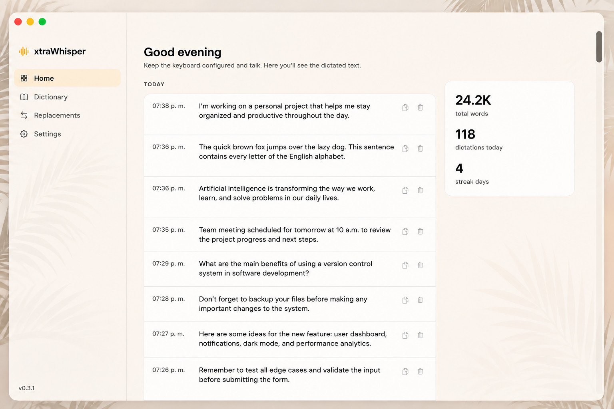

# xtraWhisper

**Voice-to-text for macOS, built for developers and writers.**

Hold a key, speak, release — your words land exactly where your cursor is, in any app. Powered by OpenAI's Realtime API, with a context-aware corrector that fixes the proper nouns the model gets wrong without touching the rest of your sentence.

---

## Highlights

### Streaming transcription
- **Push-to-talk hotkey** — any key or modifier you want, configured in seconds.
- **Live results** as you speak, powered by `gpt-realtime-whisper` over WebSocket.
- **Two display modes**: a floating bubble at the bottom of your screen, or text typed directly at your cursor while you speak.
- **Multi-provider support**: OpenAI, Groq, Google, and Deepgram — bring your own API key for any of them.

### Intelligence layer
- **Contextual corrector**: a small LLM pass that fixes proper nouns, brand names, and jargon based on your personal glossary — without rewriting your sentences.
- **Exact replacements**: regex rules with Unicode word boundaries for deterministic corrections (`oceano` → `Oxeano`, `chat gpt` → `ChatGPT`, etc.). Supports multi-trigger rules.
- **Conservative mode**: when the realtime model gets too aggressive cleaning fillers, switch the corrector to glossary-only mode.

### Learns from your corrections
- After every paste, xtraWhisper waits about a minute and re-reads the field via the Accessibility API.
- If you hand-corrected a word (e.g. `strile` → `stripe`), the rule is added automatically to both Replacements and Dictionary.
- A toast appears top-right confirming the new entry, with one-click **Undo** in case it was a false positive.

### Built for macOS
- **Menubar app**, lives quietly in the status bar — no Dock icon.
- **System language detection**: UI in English, Spanish, or Portuguese depending on your macOS language settings.
- **Translucent window with subtle blur**, native macOS feel.
- **Smart permission prompts**: the in-app "Enable" buttons open the exact pane of System Settings you need — no hunting through menus.
- **Automatic updates** delivered straight to the app; no manual reinstalls.

### Privacy by design
- Your API keys are stored locally on your Mac. They never leave your machine except to call the provider you chose.
- Transcripts stay on your device. No analytics, no telemetry, no account required.
- Audio is sent directly to the provider you configure (OpenAI, Groq, etc.), never relayed through a third party.

---

## Install

1. Download the latest `.zip` from the [Releases](../../releases/latest) page.
2. Unzip and drag `xtraWhisper.app` into `/Applications`.
3. First launch: **right-click → Open** to bypass the "unidentified developer" prompt.
4. Grant **Microphone** and **Accessibility** permissions when asked — the in-app buttons walk you straight to the right System Settings pane.
5. Open the menubar icon → Settings, paste your API key, pick your push-to-talk key, and you're ready.

## Use

Hold your configured key, talk, let go. The transcribed text is pasted at the cursor in whatever app you're in.

That's the whole thing.

## Updates

xtraWhisper checks for new versions in the background and prompts you when one is available. You can also trigger a manual check anytime from the menubar icon → **Check for Updates…**

## Requirements

- macOS 14 or later
- An API key from at least one supported provider (OpenAI is recommended for the best realtime experience)
- Microphone and Accessibility permissions
